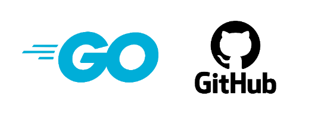
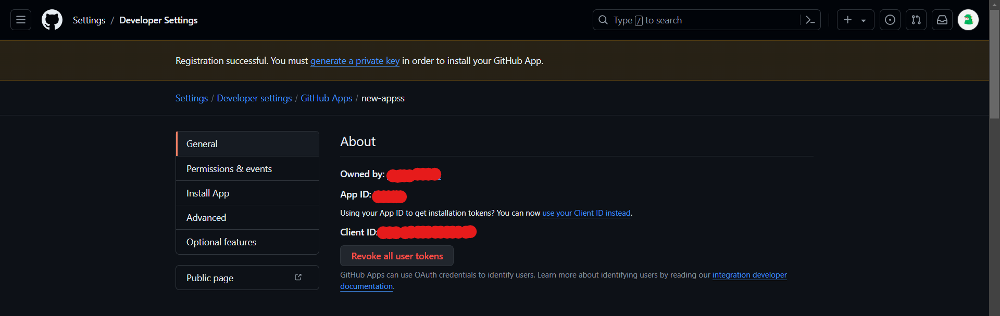
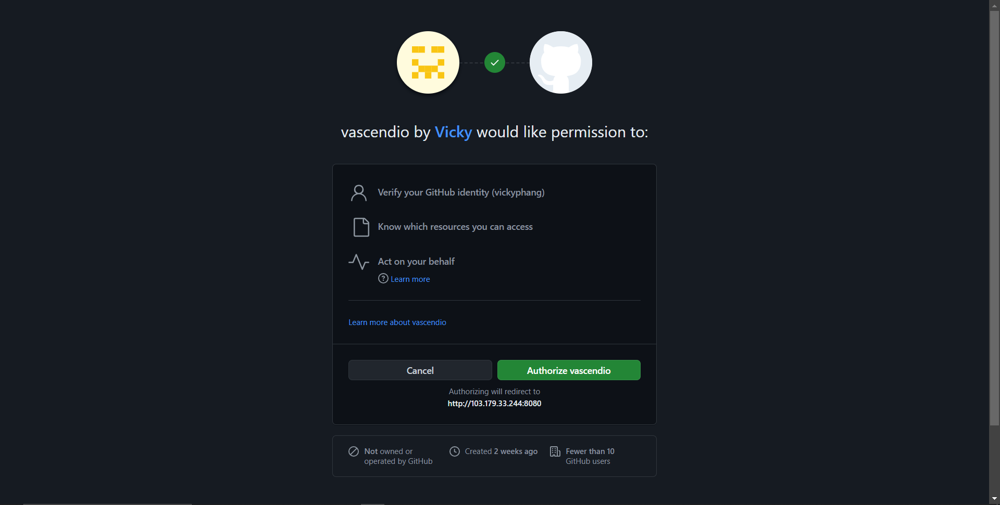
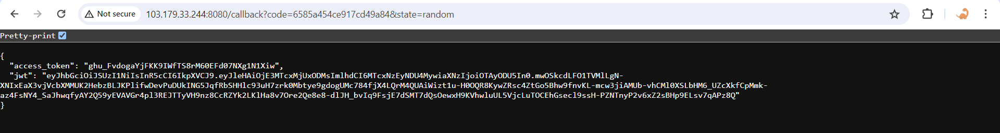
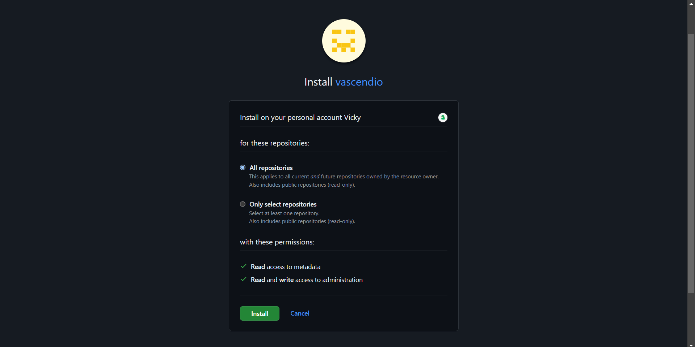

# Ascendio 🏊
[](https://github.com/vickyphang/ascendio/blob/main/LICENSE)


### Github Apps Integration for Hyperback Project
<p align="center">  </p>

## Overview
this project generate a login button and install the github app to a repository also generate access token + jwt token for API interaction

A GitHub App is a type of integration that you can build to interact with and extend the functionality of GitHub. You can build a GitHub App to provide flexibility and reduce friction in your processes, without needing to sign in a user or create a service account.


## Setup a Github Apps
#### 1. Register github apps
- Go to GitHub's `Developer Settings` and create a new `GitHub App`: https://github.com/settings/apps.

#### 2. Fill in the necessary details:
- `GitHub App Name`: Choose a unique name for your app.
- `Homepage URL`: Set it to your server's URL (for development, http://localhost:8080).
- `Callback URL`: Set it to http://localhost:8080/callback.
- `Webhook URL`: (Optional: you can turn it off) Set it to http://localhost:8080/webhook.
- `Permissions`: Set the permissions your app will need.
- `Events`: Subscribe to Installation and InstallationRepositories events.
- `Where can this GitHub App be installed?`: Choose `Only on this account` for development purpose

#### 3. Save the credentials `App ID` and `Client ID`
<p align="center">  </p>

#### 4. Generate a new client secret and store it
<p align="center">  </p>

#### 5. Generate a private key and save it as private-key.pem
<p align="center">  </p>


## Setup Golang Application
Clone this repository into your server
```bash
git clone https://github.com/vickyphang/ascendio.git

cd ascendio
```

Make sure you have `docker` installed. Build the application from `Dockerfile`
```bash
docker build -t golang-app:v1 .
```

Copy `private-key.pem` to this folder. Run the application
```bash
docker run -p 8080:8080 --name golang-app /
    -e CLIENT_ID="<client-id>" /
    -e CLIENT_SECRET="<client-secret>" /
    -e APP_ID="<app-id>" /
    -e PRIVATE_KEY_PATH="/app/private-key.pem" /
    -v private-key.pem:/app  /
    golang-app:v1
```

Open browser and access: `http://host-ip:8080/login`
<p align="center">  </p>

When authorized, the apps will give callback. You will get `access token` and `jwt token`
<p align="center">  </p>

In order to use the `jwt token` you have to install the github apps into your github repository. To install github apps, access: `http://host-ip:8080/install`
<p align="center">  </p>